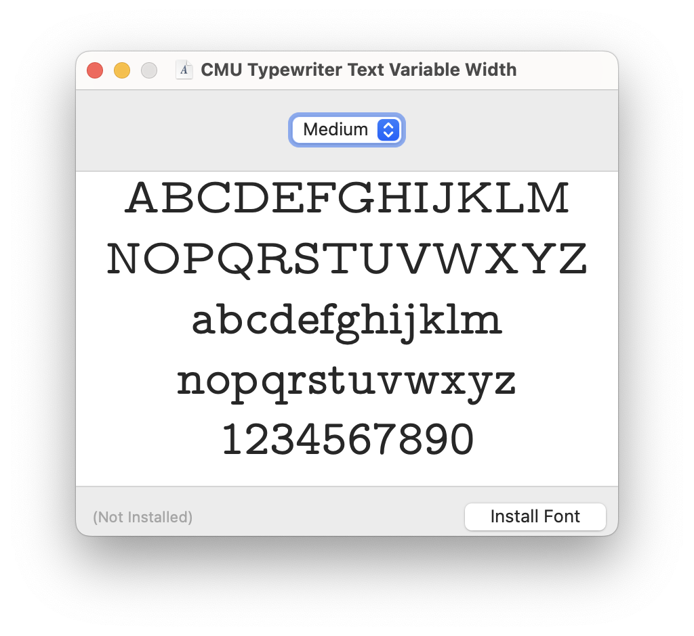

# Unitn-Latex-like-Pages-Template
This repository contains a Latex-like template suitable for students of the DISI department who find using Pages more handy than Latex. 

## Compatibility
- Pages version 12.x

## How to Run
1. Clone the repository to a folder
1. Install fonts first:
  - on Mac simply double-click on fonts and the FontBook app should open
  
  
  - then `Install`.
3. Then open the [Template](Latex-like%20Unitn%20Report%20Template.template)
